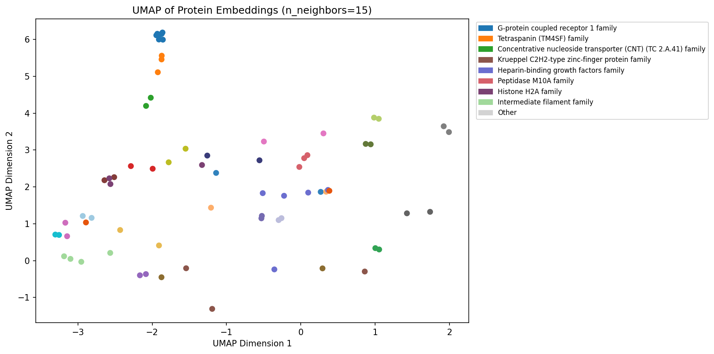
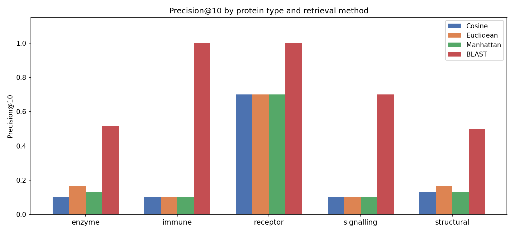

# Protein embedding similarity search and clustering

A bioinformatics project exploring whether ESM2 protein language model embeddings capture functional relationships between proteins — and whether embedding-based similarity search can approach the performance of classical sequence alignment (BLAST).

## Biological question

Do proteins with similar structures and functions cluster together in ESM2 embedding space, even when their amino acid sequences look completely different? And can we build a meaningful similarity search in that space?

The key insight: two proteins with very different sequences can have similar embeddings if they fold similarly or perform similar functions. Classical sequence alignment (BLAST) misses these relationships. Embedding-based similarity can find them — but only when the search space is large enough and the model is powerful enough.

## Key findings

**Clustering**
- ESM2 embeddings contain genuine biological structure detectable by all three clustering algorithms (k-means, HDBSCAN, hierarchical)
- All 26 k-means clusters show statistically significant GO term enrichment (p < 0.05), corresponding to biologically coherent categories: GPCRs, nucleosomes, immunoglobulins, kinases, transcription factors, extracellular matrix proteins
- GPCRs are the most consistently distinct family — they form a tight, isolated cluster in every analysis method
- K-means ARI against known protein families: 0.494 (k=29), HDBSCAN: 0.445 (k=26 automatic), hierarchical: 0.433 (k=30)
- K-means stability ARI: 0.697 across 10 subsampled runs; HDBSCAN stability: 0.417 (more sensitive to subsample density)

**Dimensionality reduction**
- Only 49 of 320 embedding dimensions explain 90% of variance — the ESM2 model encodes protein information compactly
- PCA-50D outperforms full 320D for clustering (ARI 0.405 vs 0.381) because dimensions 50-320 add noise rather than signal
- UMAP and t-SNE significantly outperform PCA for family separation (ARI ~0.63 vs 0.17) — protein embedding space is non-linear


*UMAP 2D projection of ESM2 embeddings (n_neighbors=15), coloured by protein family. Membrane protein families — G-protein coupled receptors, Tetraspanins, and Concentrative nucleoside transporters — separate cleanly along the vertical axis despite divergent amino acid sequences. The GPCR separation is consistent with the precision@10 result, where embedding similarity reached BLAST-comparable performance specifically for this family.*


**Similarity search vs BLAST**
- All three distance metrics (cosine, Euclidean, Manhattan) perform identically (precision@10 ≈ 0.114) — a consequence of the tight L2 norm distribution in ESM2 embeddings
- BLAST outperforms embedding search overall (mean precision@10: 0.645 vs 0.170) across 10 diverse query proteins
- **Key exception:** for GPCRs, embedding search reaches precision@10 = 0.700 vs BLAST 1.000 — near-comparable performance when the relevant proteins are well-represented in the search space
- The comparison is confounded by two differences simultaneously: similarity metric (sequence vs vector) and search space (20,000 vs 376 proteins). A fair comparison requires full SwissProt embeddings.


*Precision@10 across 10 query proteins by category, comparing three embedding distance metrics (cosine, Euclidean, Manhattan) against BLAST. The three distance metrics produce nearly identical results — a consequence of the tight L2 norm distribution in ESM2 embeddings. BLAST outperforms embedding search in 4 of 5 categories. The exception is receptors (GPCRs), where embedding precision@10 reaches 0.70 versus BLAST's 1.00 — the closest the two methods come to comparable performance, and a hint that embeddings may carry their own weight when relevant proteins are well-represented in the search space.*

## Detailed analysis

Writeups with full methodology, intermediate results, and reasoning:

- [1 — Data exploration and embeddings](analysis/01_data_exploration_and_embeddings.md)
- [2 — Dimensionality reduction](analysis/02_dimensionality_reduction.md)
- [3 — Clustering](analysis/03_clustering.md)
- [4 — Similarity search vs BLAST](analysis/04_similarity_search_vs_blast.md)


## Methods summary

| Component | Detail |
|-----------|--------|
| Embedding model | ESM2 `esm2_t6_8M_UR50D` (8M parameters, 320D) |
| Dataset | 500 reviewed human proteins from UniProt SwissProt |
| Annotations | GO terms and protein families from UniProt REST API |
| Dimensionality reduction | PCA, t-SNE, UMAP — compared by ARI against family labels |
| Clustering | K-means (implemented from scratch + sklearn), HDBSCAN, hierarchical (Ward linkage) |
| Cluster validation | ARI vs family labels, silhouette score, GO term hypergeometric enrichment, stability across 10 subsampled runs |
| Similarity search | Brute-force cosine / Euclidean / Manhattan nearest neighbour |
| BLAST comparison | BioPython NCBIWWW blastp against human SwissProt, precision@10 with GO biological process overlap |

## Project structure

```
protein-search/
├── README.md
├── environment.yml
├── src/
│   ├── data_loader.py       # UniProt API, ESM2 embeddings, save/load
│   ├── search.py            # cosine / Euclidean / Manhattan nearest neighbour
│   ├── blast_search.py      # remote NCBI BLASTp against SwissProt
│   ├── precision_at_10.py   # precision@10 evaluation via GO term overlap
│   ├── clustering.py        # k-means from scratch + sklearn wrappers
│   ├── reduction.py         # PCA, t-SNE, UMAP wrappers
│   ├── evaluation.py        # ARI, silhouette, Davies-Bouldin
│   └── go_enrichment.py     # hypergeometric test for GO term enrichment
├── notebooks/
│   ├── 01_eda.ipynb
│   ├── 02_dimensionality_reduction.ipynb
│   ├── 03_clustering.ipynb
│   └── 04_similarity_vs_blast.ipynb
├── analysis/
│   ├── 01_data_exploration_and_embeddings.md
│   ├── 02_dimensionality_reduction.md
│   ├── 03_clustering.md
│   └── 04_similarity_search_vs_blast.md
└── outputs/
    ├── figures/
    │   ├── pca_variance.png
    │   ├── kmeans_elbow.png
    │   ├── umap_families.png
    │   └── dimred_comparison.png
    │   ├── precision_at_10.png
    └── tables/
        ├── clustering_metrics.csv
        ├── go_enrichment.csv
        └── precision_at10_results.csv
```

## How to reproduce

**1. Set up the environment**
```bash
conda env create -f environment.yml
conda activate protein-search
```

**2. Fetch data and compute embeddings**

Open `notebooks/01_data_setup.ipynb` and run all cells. This fetches 500 human SwissProt proteins from UniProt, computes ESM2 embeddings, and saves `data/raw/annotations.csv` and `data/raw/embeddings.npy`.

Note: embedding computation takes 20-40 minutes on CPU.

**3. Run analysis notebooks in order**

```
02_dimensionality_reduction.ipynb  — PCA, t-SNE, UMAP comparison
03_clustering.ipynb                — k-means, HDBSCAN, hierarchical, GO enrichment
04_similarity_vs_blast.ipynb       — precision@10, BLAST comparison
```

**4. Data is gitignored**

The `data/` folder is not committed. Re-run notebook 01 to regenerate it.

## Limitations and next steps

- **Model size:** ESM2 8M parameters is the smallest available variant. The 650M parameter model would produce significantly better embeddings but requires a GPU.
- **Dataset size:** 500 proteins is too small for a fair BLAST comparison. Running on all ~20,000 reviewed human SwissProt proteins would allow a controlled comparison where search space size is equal.
- **Fair comparison:** the BLAST vs embedding comparison differs in both metric and search space simultaneously. Computing ESM2 embeddings for full SwissProt would isolate the metric effect.

## Technical note on k-means

K-means was implemented from scratch in numpy using random initialisation and convergence detection via centre stability. Verified against sklearn's k-means++ implementation — ARI scores differ by less than 0.03, confirming correctness. The scratch implementation was used to understand the algorithm's assumptions; sklearn's version (with k-means++ initialisation) was used for all reported results.